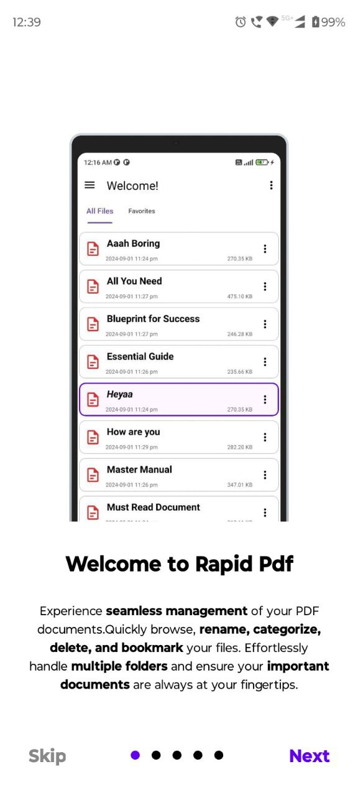

# RapidPDF - Simplify Your PDF Management

**RapidPDF** is a fast and efficient PDF management tool designed to streamline your workflow. Whether you're a student, professional, or frequent PDF user, RapidPDF helps you stay organized with powerful yet easy-to-use features.

## 🚀 Features

- **📄 Rapid Skimming:** Quickly swipe through multiple PDFs without opening each file individually.
- **🗑️ Delete & Rename:** Easily manage your PDFs by renaming files and removing unwanted documents.
- **📂 Categorize Files:** Organize your PDFs into custom categories for easy access.
- **🖥️ User-Friendly Interface:** Intuitive UI for a seamless PDF management experience.

## 🛠️ Tech Stack

- **Language:** Kotlin (Android)
- **PDF Processing:** PDF Renderer/PDF viewer
- **Storage:** Room Database, SharedPreferences
- **UI Framework:** Material UI, XML
- **Version Control:** Git & GitHub

## 📷 Screenshots

  
  
  

  
  
  

